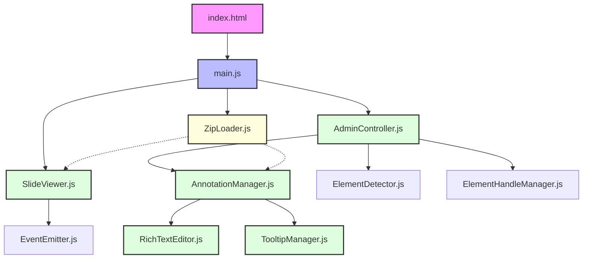
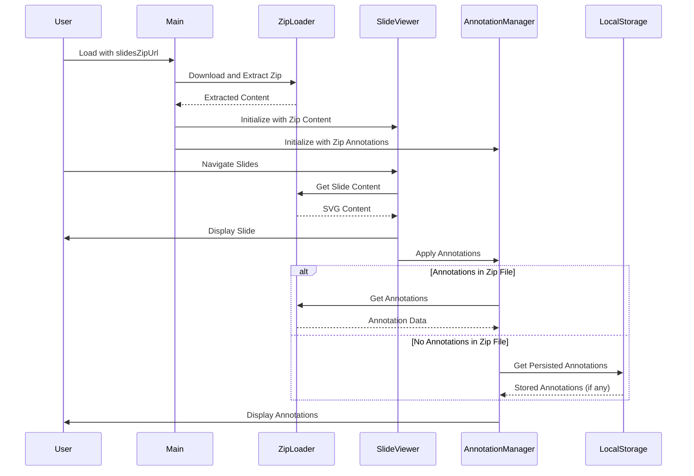

# Slide Viewer Architecture

This document provides a technical overview of the Slide Viewer application architecture, including module relationships, data flow, and maintenance instructions.

## System Overview

The Slide Viewer is a modular web application built with vanilla JavaScript using ES6 modules. It provides SVG slide viewing capabilities with advanced annotation features, including rich text editing, persistent storage, and interactive tooltips.



## Core Modules

### SlideViewer
- **Purpose**: Handles loading and navigating through SVG slides
- **Key Responsibilities**:
  - Loading SVG files from the slides directory or zip content
  - Managing slide navigation (previous/next)
  - Handling keyboard navigation
  - Emitting events for slide changes

### ZipLoader
- **Purpose**: Handles downloading and extracting zip files containing slides and annotations
- **Key Responsibilities**:
  - Downloading zip files from remote URLs
  - Extracting SVG slides and annotation data
  - Supporting multiple annotation file names (`slide-annotations.json` or `annotations.json`)
  - Providing slides to the SlideViewer
  - Providing annotations to the AnnotationManager
  - Dynamically loading the JSZip library when needed

### AdminController
- **Purpose**: Manages admin mode functionality
- **Key Responsibilities**:
  - Toggling edit mode
  - Managing element selection and highlighting
  - Coordinating with AnnotationManager for annotation operations
  - Handling annotation downloads

### AnnotationManager
- **Purpose**: Core annotation handling system
- **Key Responsibilities**:
  - Creating, saving, and loading annotations
  - Persisting annotations to localStorage and files
  - Managing annotation positioning and display
  - Coordinating with TooltipManager for annotation display

### TooltipManager
- **Purpose**: Handles tooltip display for annotated elements
- **Key Responsibilities**:
  - Registering annotated elements
  - Managing tooltip positioning and visibility
  - Adding visual indicators to annotated elements
  - Handling mouse interactions for tooltips

### RichTextEditor
- **Purpose**: Provides rich text editing for annotations
- **Key Responsibilities**:
  - Creating and managing the editor modal
  - Handling text formatting operations
  - Supporting HTML mode for advanced editing
  - Managing link creation and formatting

## Data Flow

### Standard Flow


### Remote Slides Flow



## Annotation Data Structure

Annotations are stored as JSON objects with the following structure:

```json
{
  "type": "annotation",
  "text": "<p>Rich text content</p>",
  "elementPath": "svg > g > path",
  "elementTag": "path",
  "elementId": "element-42",
  "elementAttributes": {
    "d": "M10,10 L20,20",
    "fill": "blue"
  },
  "position": {
    "left": "100px",
    "top": "200px"
  },
  "created": "2025-05-17T10:30:00.000Z"
}
```

## Storage Mechanisms

The application uses three storage mechanisms for content and annotations:

1. **Remote Zip Files**: Slides and annotations can be loaded from remote zip files via URL parameter
2. **File-based Storage**: Annotations are saved as JSON files in the slides directory
3. **localStorage**: Used as a fallback and for temporary storage between sessions

### Loading Priority

The application prioritizes loading in this order:

1. If a remote zip file is specified (`slidesZipUrl` parameter):
   - Load slides from the zip file
   - Load annotations only from the zip file if present
   - Fall back to localStorage for annotations if not in zip file
   - Never load local annotation files when using remote zip

2. If no remote zip file is specified:
   - Load slides from the local slides directory
   - Try to load annotations from local `slide-annotations.json` file
   - Fall back to localStorage if local annotation file is not found

## Event System

The application uses a custom event system for communication between modules:

- **beforeSlideLoad**: Fired before a new slide is loaded
- **afterSlideLoad**: Fired after a new slide is loaded and rendered
- **annotationCreated**: Fired when a new annotation is created
- **annotationUpdated**: Fired when an annotation is updated
- **annotationRemoved**: Fired when an annotation is removed

## Maintenance Instructions

### Adding New Features

1. **New Annotation Types**:
   - Extend the `createAnnotation` method in AnnotationManager
   - Add rendering logic in the appropriate display methods
   - Update the persistence methods to handle the new type

2. **New UI Components**:
   - Add HTML elements to index.html
   - Add corresponding styles to styles.css
   - Connect event handlers in the appropriate controller module

3. **New Storage Mechanisms**:
   - Implement new save/load methods in AnnotationManager
   - Ensure backward compatibility with existing storage

### Common Maintenance Tasks

#### Updating Tooltip Behavior
Modify the `TooltipManager.js` file:
- Positioning logic is in the `positionTooltip` method
- Hover behavior is controlled by mouse event handlers
- Visual styling is defined in styles.css

#### Modifying Rich Text Editor
Edit the `RichTextEditor.js` file:
- Add new toolbar buttons in the `createModal` method
- Implement new commands in the `execCommand` method
- Update styling in the CSS

#### Changing Annotation Indicators
Update the `addAnnotationIndicator` method in TooltipManager:
- Modify the SVG element creation for different visual styles
- Adjust positioning calculations as needed
- Update corresponding CSS styles

### Troubleshooting

#### Annotations Not Displaying
- Check if the element path is correct and the element exists in the SVG
- Verify that the annotation data is properly loaded from storage
- Check the browser console for any errors in the annotation application process

#### Rich Text Editor Issues
- Ensure the content is properly sanitized before saving
- Check for conflicts with keyboard event handlers
- Verify that the editor modal is properly created and styled

#### Performance Problems
- Optimize SVG handling for large files
- Consider lazy loading for annotations on complex slides
- Implement pagination or virtualization for large numbers of annotations

## Future Development Considerations

1. **Server-Side Storage**: Implement a backend for storing annotations on a server
2. **User Authentication**: Add user accounts for personalized annotations
3. **Collaborative Editing**: Enable real-time collaboration on annotations
4. **Mobile Optimization**: Enhance touch support for mobile devices
5. **Accessibility Improvements**: Ensure ARIA compliance and keyboard navigation
6. **Enhanced Remote Content**:
   - Support for other archive formats (RAR, 7z)
   - Streaming content loading for large presentations
   - Incremental loading of slides for faster startup
   - Caching of remote content for offline use
7. **Content Management System Integration**:
   - Integration with popular CMS platforms
   - API for dynamic slide generation

## Technical Debt and Known Issues

1. **SVG Scaling**: Complex SVGs may have positioning issues with annotations
2. **Browser Compatibility**: Some advanced features may not work in older browsers
3. **Performance**: Large SVGs with many annotations may cause performance issues
4. **Error Handling**: Some edge cases may not have comprehensive error handling

## Version History

- **v1.0.0** (2025-05-17): Initial release with basic annotation features
- **v1.1.0**: Added rich text editing and improved tooltip behavior
- **v1.2.0**: Added file-based annotation storage and enhanced positioning
